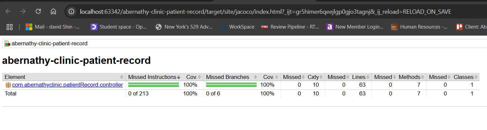

# Doctor's Clinical Notes Management API at Abernathy Clinic

## 1. Project Description

This is a Spring Boot REST API designed for managing doctor's clinical notes at Abernathy Clinic. It provides endpoints to:

- Retrieve a patient's clinical notes based on their patient ID.
- Retrieve all patient records with clinical notes.
- Add new clinical notes to a patient's record, creating a new patient record if one doesn't already exist.
- Update specific clinical notes within a patient's record.

The API is built using Spring Boot and utilizes a MongoDB database for persistent storage.

**Key Components:**

- **Controller:** `PatientRecordController.java` (located in the project's controller package)
- **Model Classes:**
    - `PatientRecord.java`: Represents a patient's record, containing a patient ID (`patId`) and a list of `ClinicalNote` objects.
    - `ClinicalNote.java`: Represents a single clinical note with a date and the note content.
    - `PatientRecords.java`: A wrapper class containing a list of `PatientRecord` objects.

## 2. Docker Deployment

This project can be easily deployed using Docker. Ensure you have Docker and Docker Compose installed on your system.

**Deployment Steps:**

1.  **Package the application:**
    Navigate to the root directory of the project in your terminal and run the following Maven command to build the application:

    ```bash
    mvn clean package
    ```

    This will create an executable JAR file (or necessary build artifacts) for your application.

2.  **Build the Docker image:**
    From the root directory of the project (where the `Dockerfile` is located), build the Docker image using the following command:

    ```bash
    docker-compose build
    ```

    This command will use the `Dockerfile` in the current directory to create the Docker image for your application.

3.  **Run Docker Compose:**
    From the root directory of the project (where the `docker-compose.yaml` file is located), run the following command:

    ```bash
    docker-compose up -d
    ```

    This command will start the application and the MongoDB database in separate containers.

**`docker-compose.yaml`:**

```yaml
services:
  abernathy-clinic-patientRecord:
    image: abernathy-clinic-patient-record
    build: .
    ports:
      - "8082:8082"
    depends_on:
      - mongo
    environment:
      SPRING_DATA_MONGODB_URI: mongodb://mongo:27017/abernathy_clinic

  mongo:
    image: mongo:latest
    ports:
      - "27017:27017"
    volumes:
      - mongo-data:/data/db

volumes:
  mongo-data:

networks:
  patient-services-network:
    name: patient-services-network

## 3. Adding Test Data

You can add test clinical notes to patient records by sending GET requests to the `/patHistory/add` endpoint with the following parameters:

- `patId`: The patient's ID.
- `note`: The clinical note to add.

Here are some example requests (you can use tools like Postman or curl):

```json
{
  "name": "Patient History Add API Tests",
  "description": "A collection of API calls to add patient history records.",
  "requests": [
    {
      "name": "Add History for TestNone",
      "method": "GET",
      "url": "http://localhost:8082/patHistory/add?patId=11&note=Patient: TestNone Practitioner's notes/recommendations: Patient states that they are 'feeling terrific' Weight at or below recommended level"
    },
    {
      "name": "Add History for TestBorderline - 1",
      "method": "GET",
      "url": "http://localhost:8082/patHistory/add?patId=12&note=Patient: TestBorderline Practitioner's notes/recommendations: Patient states that they are feeling a great deal of stress at work Patient also complains that their hearing seems Abnormal as of late"
    },
    {
      "name": "Add History for TestBorderline - 2",
      "method": "GET",
      "url": "http://localhost:8082/patHistory/add?patId=12&note=Patient: TestBorderline Practitioner's notes/recommendations: Patient states that they have had a Reaction to medication within last 3 months Patient also complains that their hearing continues to be problematic"
    },
    {
      "name": "Add History for TestInDanger - 1",
      "method": "GET",
      "url": "http://localhost:8082/patHistory/add?patId=13&note=Patient: TestInDanger Practitioner's notes/recommendations: Patient states that they are short term Smoker"
    },
    {
      "name": "Add History for TestInDanger - 2",
      "method": "GET",
      "url": "http://localhost:8082/patHistory/add?patId=13&note=Patient: TestInDanger Practitioner's notes/recommendations: Patient states that they quit within last year Patient also complains that of Abnormal breathing spells Lab reports Cholesterol LDL high"
    },
    {
      "name": "Add History for TestEarlyOnset - 1",
      "method": "GET",
      "url": "http://localhost:8082/patHistory/add?patId=14&note=Patient: TestEarlyOnset Practitioner's notes/recommendations: Patient states that walking up stairs has become difficult Patient also complains that they are having shortness of breath Lab results indicate Antibodies present elevated Reaction to medication"
    },
    {
      "name": "Add History for TestEarlyOnset - 2",
      "method": "GET",
      "url": "http://localhost:8082/patHistory/add?patId=14&note=Patient: TestEarlyOnset Practitioner's notes/recommendations: Patient states that they are experiencing back pain when seated for a long time"
    },
    {
      "name": "Add History for TestEarlyOnset - 3",
      "method": "GET",
      "url": "http://localhost:8082/patHistory/add?patId=14&note=Patient states that they are a short term Smoker Hemoglobin A1C above recommended level"
    },
    {
      "name": "Add History for TestEarlyOnset - 4",
      "method": "GET",
      "url": "http://localhost:8082/patHistory/add?patId=14&note=Patient states that Body Height, Body Weight, Cholesterol, Dizziness and Reaction"
    }
  ]
}
```

## 4. JaCoCo Report

The JaCoCo code coverage report for this project can be found within the project structure at:


This report provides details on the test coverage of the codebase.

## 5. Minimum Java Version

This project requires **Java 21** or a later version to run. Please ensure that your Java environment meets this minimum requirement.